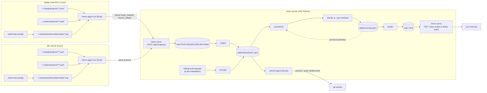

# Heron

A heron stands in the water and watches. This one watches your agent
sessions (Claude Code, Codex) and your terminals on every machine you work
from, ships them to one server, and every two hours writes up what is being
worked on: one plain page, one tab per topic, a milestone bar per topic, and
every claim cited with a link into the exact transcript turn it came from.
The server can also commit and push the work the transcripts show passing
its tests.

Two programs, see [DESIGN.md](DESIGN.md) for the contract between them:

- `client/` — **heron-agent**, a Rust binary. Runs in the background on a
  laptop or a server, tails the transcript files, records interactive shells
  with `script`, ships new bytes. Releases for Linux and macOS are built by
  GitHub Actions on every push to `master`; the macOS zip is a
  double-clickable `Heron.app`.
- `heron/` — the server, Python 3 with no dependencies beyond the `claude`
  CLI it uses for summaries. `bin/heron serve` receives uploads and serves
  the site behind HTTP Basic auth; `bin/heron site` collects, fetches the
  maintainers' pull requests, summarizes and renders; `bin/heron commit`
  runs the commit agent.

## How the pieces fit

Every two hours `heron site` runs the collect, prs, summarize and render
steps; the summarizer receives its previous output so the posts change
incrementally. GitHub renders this Mermaid diagram in place.

## Server

    git clone <this repo> /opt/heron
    /opt/heron/deploy/install-server.sh      # writes /etc/heron/config.json, prints the tokens
    systemctl status heron-server heron-site.timer heron-commit.timer

Put the server behind TLS (a reverse proxy, a Tailscale funnel path, …).
The site is never served without the Basic auth in the config: the
transcripts hold whatever your shells printed.

## A machine you work on

Download `heron-agent` for your platform from the latest release (or
`Heron.app` on macOS), then:

    heron-agent install --server https://your.server/heron --token <ingest_token>

That writes `~/.config/heron/agent.toml`, adds the shell hook to
`~/.bashrc` and `~/.zshrc`, and registers a launchd agent or a systemd user
service so it runs at login. Open a new shell; from then on it is recorded.
`HERON_NO_RECORD=1` before opening a shell skips that one.

## The page

Topics come from `claude -p` with a JSON schema: title, status, milestones
with done/not done, and a post in Markdown whose `[[S1a2b3c4#12]]` citations
become links to `sessions/S1a2b3c4.html#t-12`. Pull requests by the
configured maintainers on the configured repositories are read with `gh`
and cited the same way (`P…` ids). The commit agent's runs get a tab of
their own.
